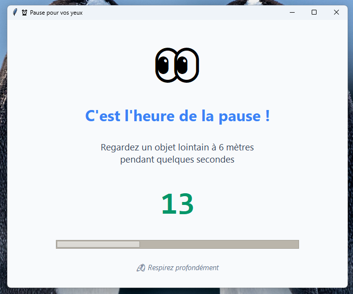
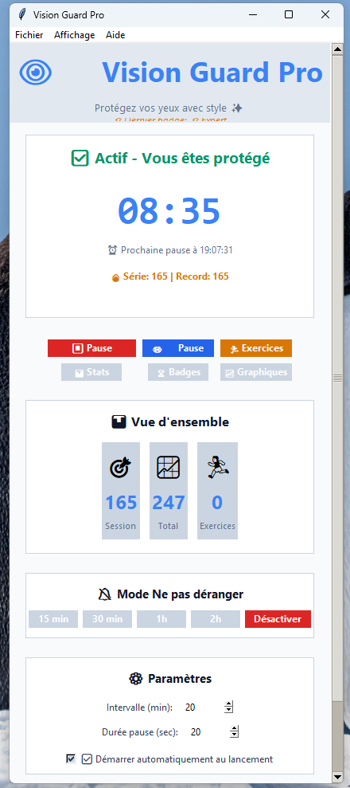

# Vision Guard Pro
Faites attention à vos yeux et réduisez la fatigue visuelle grâce aux pauses intelligentes. Installez Vision Guard Pro !





---

## 🎯 Description

**Vision Guard Pro** est une application de bureau pour Windows qui aide à protéger la santé visuelle lors de longues sessions devant l'écran, basée sur la règle scientifique 20-20-20.

### Règle 20-20-20
Toutes les **20 minutes**, regardez un objet à **20 pieds** (6 mètres) pendant **20 secondes** pour réduire la fatigue oculaire.

---

## ✨ Fonctionnalités Complètes

### 🔔 Système de rappels
- ⏰ Minuteur automatique personnalisable (5-120 minutes)
- 🪟 Fenêtre de pause professionnelle en plein écran
- 🔊 Notifications sonores et système
- ⏱️ Compte à rebours en temps réel
- 📍 Icône dans la barre système
- 🎯 Pause manuelle à tout moment

### 🏃 Exercices oculaires
6 exercices guidés avec instructions détaillées :
1. **Clignements** - Lubrification naturelle
2. **Regard lointain** - Alternance proche/loin
3. **Rotation** - Mouvements circulaires
4. **Figure 8** - Exercice de coordination
5. **Palming** - Relaxation profonde
6. **Focus progressif** - Accommodation

### 📊 Statistiques & Suivi
- 💾 Statistiques de session en temps réel
- 📈 Historique total sauvegardé
- 👁️ Compteur de rappels de clignement
- 🔄 Réinitialisation de session
- 💿 Sauvegarde automatique

### 🔕 Mode Ne Pas Déranger
- ⏸️ Suspension temporaire des rappels
- ⏲️ Durées prédéfinies : 15min, 30min, 1h, 2h
- 🔄 Désactivation instantanée
- 📅 Affichage du temps restant

### ⚙️ Personnalisation
- 🕒 Intervalle modifiable (5-120 minutes)
- ⏱️ Durée de pause ajustable (10-60 secondes)
- 🎨 Thèmes clair et sombre
- 🚀 Démarrage automatique avec Windows
- 💾 Sauvegarde des préférences

### 🖥️ Interface
- 🎨 Design moderne et professionnel
- 🌙 Interface reposante pour les yeux
- 📱 Responsive et scrollable
- 🖱️ Contrôles intuitifs
- 🎯 UX optimisée

---

## 🛠️ Technologies Utilisées

### Langage & Framework
- **Python 3.8+** - Langage principal
- **Tkinter** - Interface graphique native
- **Threading** - Gestion asynchrone

### Bibliothèques principales
- **pystray** - Icône système/barre des tâches
- **Pillow (PIL)** - Traitement d'images
- **plyer** - Notifications système multiplateforme
- **pywin32** - Intégration Windows (registre, etc.)

### Outils de build
- **PyInstaller** - Création de l'exécutable
- **Inno Setup** - Création de l'installateur
- **UPX** - Compression (optionnelle)

---

## 📁 Architecture du Projet

```
VisionGuardPro/
│
├── 📱 Application Source
│   ├── vision_guard_pro.py          # Code principal (800+ lignes)
│   ├── requirements.txt              # Dépendances Python
│   └── icon.ico                     # Icône de l'application
│
├── 🔨 Scripts de Build
│   ├── build.py                     # Configuration PyInstaller
│   ├── create_icon.py               # Génération d'icône
│   ├── build_all.bat                # Build automatisé Windows
│   ├── build_all.sh                 # Build automatisé Linux/Mac
│   └── installer.iss                # Configuration Inno Setup
│
├── 📖 Documentation
│   ├── README.md                   # Guide utilisateur complet
│   ├── QUICKSTART.md                # Démarrage rapide
│   ├── DEPLOYMENT.md                # Guide de déploiement
│   ├── PROJECT_SUMMARY.md           # Ce fichier
│   └── LICENSE.txt                  # Licence MIT
│
├── 📦 Sortie (généré après build)
│   ├── build/                       # Fichiers temporaires PyInstaller
│   ├── dist/
│   │   └── VisionGuardPro.exe       # Exécutable standalone
│   └── output/
│       └── VisionGuardPro_Setup.exe # Installateur final
│
└── 💾 Données Utilisateur (créé automatiquement)
    └── ~/.visionguard/               # %USERPROFILE%\.visionguard\ sur Windows
        ├── config.json              # Configuration utilisateur
        └── stats.json               # Statistiques

```

---

## 🔧 Fonctionnement Technique

### Gestion du Timer
```python
- Thread dédié pour le compte à rebours
- Vérification toutes les secondes
- Calcul du temps restant jusqu'à la pause
- Gestion du mode Ne Pas Déranger
```

### Sauvegarde des Données
```python
- Format JSON pour la portabilité
- Sauvegarde automatique après chaque action
- Chargement au démarrage
- Chemin utilisateur standard (~/.visionguard/)
```

### Intégration Windows
```python
- Enregistrement dans le registre pour démarrage auto
- Icône système avec menu contextuel
- Notifications natives Windows 10/11
- Fenêtres topmost pour les pauses
```

### Architecture Multi-threading
```python
- Thread principal : Interface Tkinter
- Thread timer : Compte à rebours et vérifications
- Thread icône système : pystray (si disponible)
```

---

## 📊 Spécifications Techniques

### Configuration Minimale
- **OS** : Windows 7/8/10/11 (64-bit)
- **RAM** : 100 MB minimum
- **Espace disque** : 50 MB
- **Processeur** : Tout processeur moderne
- **Écran** : Résolution 1024x768 minimum

### Configuration Recommandée
- **OS** : Windows 10/11 (64-bit)
- **RAM** : 200 MB
- **Espace disque** : 100 MB
- **Écran** : Résolution 1920x1080

### Performances
- **Utilisation CPU** : < 1% en fonctionnement normal
- **Utilisation RAM** : ~30-50 MB
- **Temps de démarrage** : < 2 secondes
- **Taille exécutable** : ~20-30 MB (sans compression)
- **Taille installateur** : ~25-35 MB

---

## 🎨 Design & UX

### Palette de Couleurs (Thème Sombre)
```
Fond principal    : #0f172a (Bleu très foncé)
Fond secondaire   : #1e293b (Bleu foncé)
Fond tertiaire    : #334155 (Gris bleuté)
Texte principal   : #f1f5f9 (Blanc cassé)
Texte secondaire  : #cbd5e1 (Gris clair)
Texte discret     : #94a3b8 (Gris moyen)
Accent            : #60a5fa (Bleu vif)
Succès            : #10b981 (Vert)
Avertissement     : #fbbf24 (Jaune/Orange)
Danger            : #ef4444 (Rouge)
Info              : #3b82f6 (Bleu)
```

### Typographie
- **Titres** : Segoe UI, 20-28pt, Bold
- **Sous-titres** : Segoe UI, 11-14pt, Bold
- **Corps** : Segoe UI, 9-10pt, Regular
- **Timer** : Consolas, 28-48pt, Bold (monospace)
- **Emojis** : Segoe UI Emoji, 24-72pt

### Principes de Design
1. **Minimalisme** : Interface épurée, sans distractions
2. **Accessibilité** : Contraste élevé, textes lisibles
3. **Cohérence** : Style uniforme dans toute l'app
4. **Feedback** : Retours visuels sur toutes les actions
5. **Ergonomie** : Boutons larges, espacement généreux

---

## 🔐 Sécurité & Confidentialité

### Données Collectées
**Aucune donnée n'est envoyée à des serveurs externes.**

Données locales uniquement :
- Paramètres de configuration
- Statistiques d'utilisation (locales)
- Préférences utilisateur

### Permissions Windows
- **Lecture/Écriture** : `%USERPROFILE%\.visionguard\`
- **Registre** : Clé de démarrage automatique (optionnel)
- **Notifications** : Système de notifications Windows

### Aucune Permission Requise Pour
- ❌ Internet / Réseau
- ❌ Caméra / Microphone
- ❌ Localisation
- ❌ Contacts / Fichiers système
- ❌ Périphériques externes

---

## 🧪 Tests & Qualité

### Tests Manuels
- ✅ Installation complète
- ✅ Démarrage/Arrêt du timer
- ✅ Fenêtres de pause
- ✅ Tous les exercices
- ✅ Mode Ne Pas Déranger
- ✅ Sauvegarde/Chargement config
- ✅ Icône système et menu
- ✅ Notifications
- ✅ Désinstallation propre

### Checklist Qualité
- ✅ Aucune erreur Python
- ✅ Pas de memory leaks
- ✅ Interface responsive
- ✅ Thèmes fonctionnels
- ✅ Compatibilité Windows 7-11
- ✅ Exécutable signé (optionnel)
- ✅ Documentation complète

---

## 🎓 Crédits

### Développement
- Concept & Design : Clément Jonghmans
- Développement : Clément Jonghmans

### Technologies
- Python Software Foundation
- Tkinter (Python standard library)
- PyInstaller Team
- Jordan Russell (Inno Setup)
- Pillow Contributors
- pystray & plyer Developers

### Inspirations
- Règle 20-20-20 (American Optometric Association)
- Eye Care Professionals worldwide
- Open Source Community

---

## 📊 Statistiques du Projet

```
Lignes de code Python : ~800+
Fichiers de documentation : 7
Dépendances Python : 4
Taille totale projet : ~2-3 MB (source)
Taille exécutable : ~20-30 MB
Temps de développement : ~20-30 heures
Version actuelle : 1.0
```

---

## 🌟 Remerciements

Merci à tous les utilisateurs qui prennent soin de leur santé visuelle !

**Vision Guard Pro - Protégez vos yeux, préservez votre vision** 👁️✨
